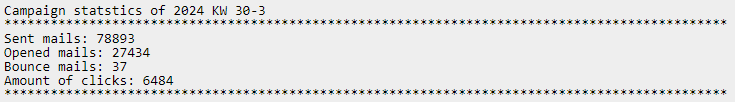

# PHP-API-Demo-Project
Sample implementation for consuming eworx Marketing Suite (eMS) API.

This demo project shows how to consume the eMS SOAP API, how to create and send campaigns and read statistic data.

There are several methods available and implemented for importing new subscribers, reading the available subscriber metadata, adding them to a certain subscriber group (profile), reading or updating campaigns etc.
Further descriptions of the eMS api can be found here: https://www.eworx.at/doku/api-schnittstellenbeschreibung/ (Documentation in German).

If you don't have access to the API, you can register your application here: https://www.eworx.at/doku/api-schnittstellenbeschreibung/#zugang-zur-api-anlegen

The name of the application registered is the one used for credentials of the service agent.

Here is a brief step by step example:

1. Preparation to use the API
2. Import the subscribers into eworx Marketing Suite
3. Create a campaign
4. Add content to the campaign
5. Send the campaign to the imported subscribers
6. Read campaign statistic data.

## 1. Preparation

First, create a ServiceAgent with the url to our webservice and your credentials.

| Login Data    | Instructions                                           |
|---------------|--------------------------------------------------------|
| Account       | Account name (Mandant) of the eMS to login             |
| Username      | User name to use to login                              |
| Password      | The user's password                                    |
| Application   | The name of the registered application                 |

##### EmsServiceAgent and a simple request
```php
// php demo code to create an eMS ServiceAgent
$serviceAgent = new \eMS\EmsServiceAgent()
    .useServiceUrl("https://mailworx.marketingsuite.info/Services/JSON/ServiceAgent.svc")
                    // Url to the eMS service.
                    // Not required, default value "https://mailworx.marketingsuite.info/Services/JSON/ServiceAgent.svc"
    .useLanguage("EN")     // Language of the text values ​​returned. Not required, default value is "EN"
    .useCredentials(
        "[Account]",        // account name (Mandant) of the eMS to login
        "[Username]",       // user name to use to login
        "[Password]",       // the user's password
        "[Application]"     // the name of the registered application
    );

// create simple request
$serviceAgent.createRequest('GetCampaigns');
```

Also set the campaign name and the profile name in the [index.php](./index.php).

Then set the campaign id of the campaign you want to read statistic data of in the [ReadCampaignStatistic](./Classes/ReadCampaignStatistic.php) class.

## 2. Import the subscribers

Use the [Importer](./Classes/Importer.php) class to do all the necessary import steps and get a list of the imported data.

## 3. Create a campaign

Use the class [CampaignCreator](./Classes/CampaignCreator.php) to create a campaign and get the ids for the campaign and the used template.

## 4. Add content to the campaign

In the [SectionCreator](./Classes/SectionCreator.php) class you generate the content sections.

## 5. Send the campaign to the imported subscribers

Create a request to send the created campaign. Use the ServiceAgent to send it out to the subscribers.

After the campaign is sent, you should see the preview of the content in the campaign editor.


## 6. Read campaign statistic data

After the campaign is sent, display the campaign statistic data.

According to the campaign you should get something like this:




Create requests to call the API methods you want to to use. Then process the data as you need.